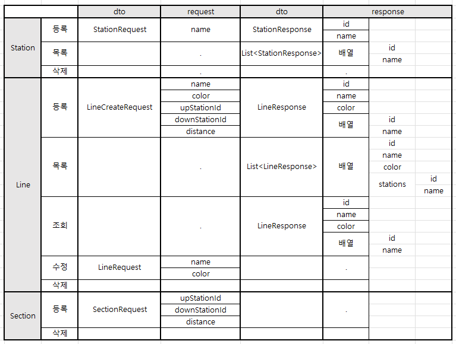

### 1단계 기능 목록

> 데이터 형식은 [API 문서](https://techcourse-storage.s3.ap-northeast-2.amazonaws.com/d5c93e187919493da3280be44de0f17f#Line) 에 따른다.

1. 지하철 역 관리 API 기능 완성
    - 지하철 역 생성 시 이미 등록된 이름으로 요청한다면 에러 응답
2. 지하철 노선 관리 API 구현
    - 지하철 노선 등록
        - (e) 등록된 이름으로 요청
    - 지하철 노선 목록
    - 지하철 노선 조회
        - (e) 조회된 노선이 없는 경우
    - 지하철 노선 수정
        - (e) 중복된 이름으로 수정
    - 지하철 노선 삭제
3. End to End 테스트 작성

### 2단계 기능 목록

1. 데이터를 H2 DB에 저장하기
    - H2 DB 설정하기
    - 테이블 생성하기
2. Spring Bean & Spring JDBC 적용하기
    - `@Controller`, `@Service`, `@Repository` 적용
    - 예외 `@ExceptionHandler`로 처리
    - JdbcTemplate는 `NamedJdbcTemplate` 사용

### 3단계 기능 목록

> [제공된 페이지](https://d2owgqwkhzq0my.cloudfront.net/index.html) 를 통해 테스트할 수 있다.  
> 변경된 [API 문서](https://techcourse-storage.s3.ap-northeast-2.amazonaws.com/c682be69ae4e412c9e3905a59ef7b7ed#Line) 는 링크를 통해 확인할 수 있다.

1. 지하철 노선 API 변경
    - 지하철 노선은 구간 정보를 포함
    - 노선 등록 시 `upStationId`, `downStationId`, `distance` 데이터 추가 입력
    - 노선 조회 시 구간 정보를 포함
2. 구간 API 구현
    - 구간 등록
        - (e) 갈래길 (ex: A역의 상행으로는 B역, C역 두 갈래가 있다)
        - (e) 새로운 역과의 길이가 기존 역과의 길이보다 크거나 같은 경우
        - (e) 이미 등록된 구간
        - (e) 존재하지 않는 역 이용
    - 구간 제거
        - 중간에 역 제거 시 구간 재배치 필요 (거리는 두 구간의 합으로 설정)

### 페어 규칙

- 불변 지향
- TDD 지키기
- 모델에서는 toString() 재정의
- 이해안된 것은 꼭 물어보기
- 5분 단위로 페어 프로그래밍
- 의견을 일치시킨 후에 코드 작성하기
